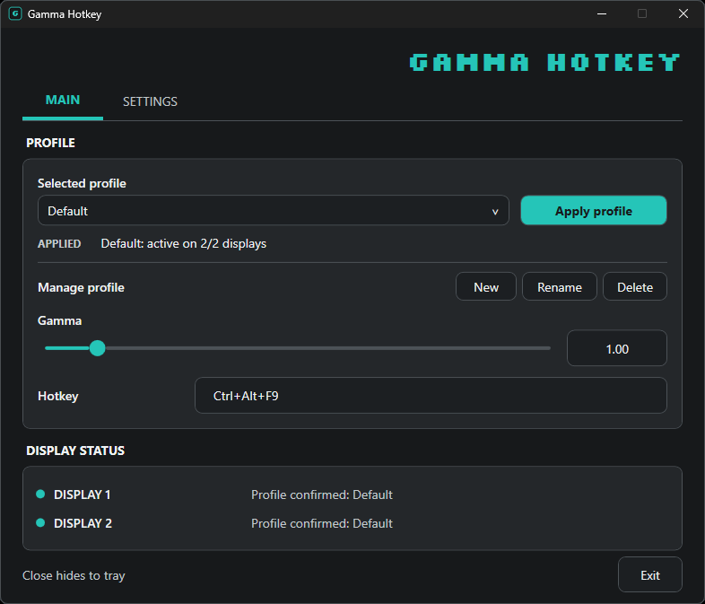

# Gamma Hotkey

A small Windows 10/11 app for adjusting gamma on **SDR displays**. Create profiles, assign shortcuts, and switch between them from the window or tray icon.



## Get started

Download `gamma-hotkey-v0.1.1-win-x64.zip` from [Releases](https://github.com/MrNogre/gamma-hotkey/releases), extract it to a permanent folder, and run `GammaHotkey.exe`. No installer or separate .NET runtime is required. Keep the executable in place if you enable **Start with Windows**.

To run from source instead, install the .NET 9 SDK and use:

```powershell
dotnet run --project GammaHotkey/GammaHotkey.csproj -c Release
```

Create a profile, set its gamma, and select **Apply profile**. Closing the window keeps the app in the tray; choose **Exit** to restore the original display ramp when possible. Settings are saved in `%LOCALAPPDATA%\GammaHotkey\settings.json`.

## Important

**Do not use with HDR enabled.** Extreme gamma values can make the screen hard to see. Test cautiously and keep Windows Display Settings available. If the app crashes or the display becomes unusable, reboot to recover. Display drivers or other color-management apps may override gamma changes.

The bundled Silkscreen font is licensed separately under the [SIL Open Font License](GammaHotkey/Fonts/OFL.txt).
